# 🔒 Cybersecurity Attack Detection Lab

## 📋 Project Overview
I built this cybersecurity lab to learn how hackers attack networks and how to defend against them. I used two virtual machines - one as an attacker (Kali Linux) and one as a target (Ubuntu). Then I created Python scripts to detect attacks in real-time and generate professional security reports.

## 🎯 What I Wanted to Learn
- How network attacks work in real life
- How to detect suspicious activity on a network
- How to analyze network traffic
- How to write security tools in Python
- How to create professional security reports

## 🛠️ Technologies I Used
- **Kali Linux** - For attacking
- **Ubuntu Linux** - As the target system
- **Python** - For writing detection scripts
- **Wireshark** - For analyzing network packets
- **Nmap** - For network scanning
- **UFW Firewall** - For defense
- **VirtualBox** - For running virtual machines

## 📸 Project Screenshots

### Step 1: Setting Up My Lab Environment
I started by creating two virtual machines on the same network so they could communicate with each other.

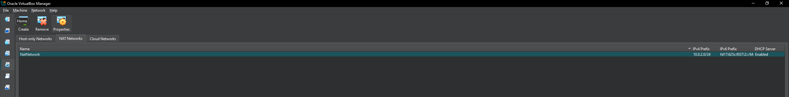
*Setting up VirtualBox with both VMs*


*Configuring Kali Linux network settings to NAT Network*

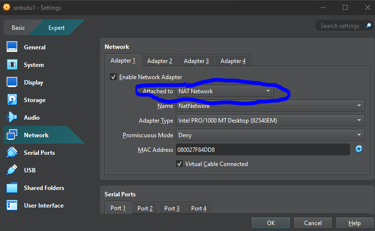
*Configuring Ubuntu network settings - both VMs are now on the same network (10.0.2.x)*

### Step 2: Preparing the Target System
I set up Ubuntu as my target system and configured its defenses.


*Updating Ubuntu system packages to latest versions*

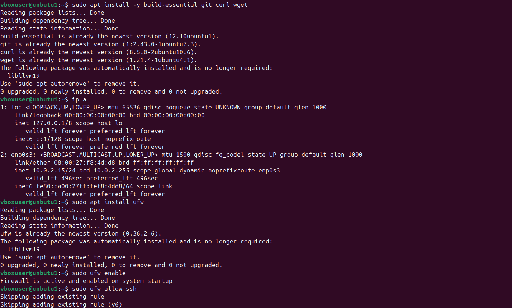
*Installing essential tools and configuring network settings*

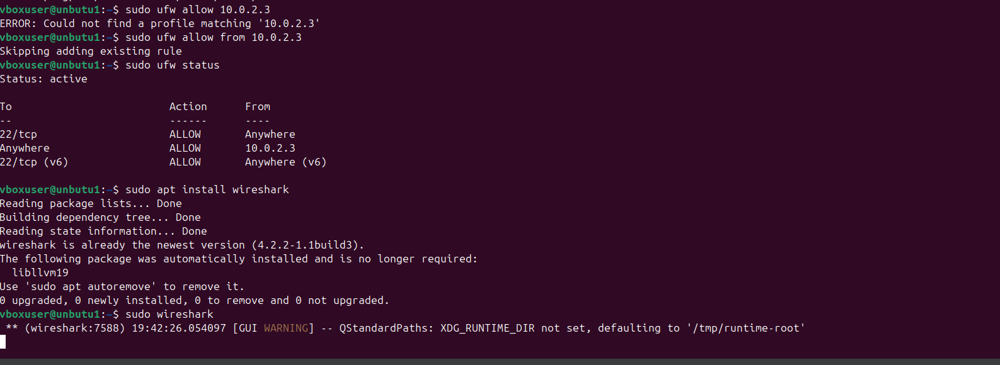
*Setting up UFW firewall - allowing SSH and connections from Kali (10.0.2.3)*

### Step 3: Preparing the Attack System
I configured Kali Linux with all the necessary hacking tools.

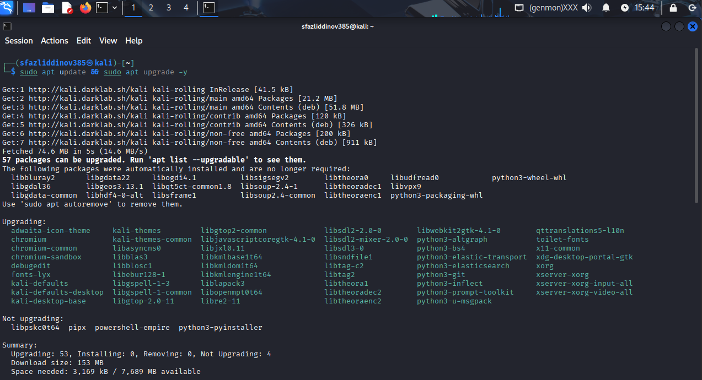
*Updating Kali Linux and installing tools*


*Kali Linux ready with Nmap and Metasploit framework*

### Step 4: Launching the Attack
I used Nmap to scan the Ubuntu machine and find open ports and services.

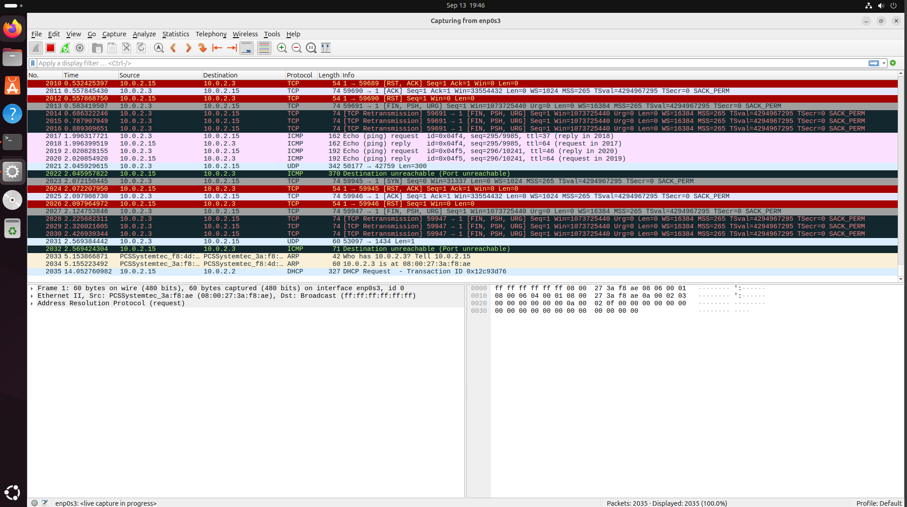
*Running Nmap scans to discover open ports on Ubuntu (10.0.2.15)*

### Step 5: Building Detection Tools
I wrote Python scripts to detect when someone is scanning my network.

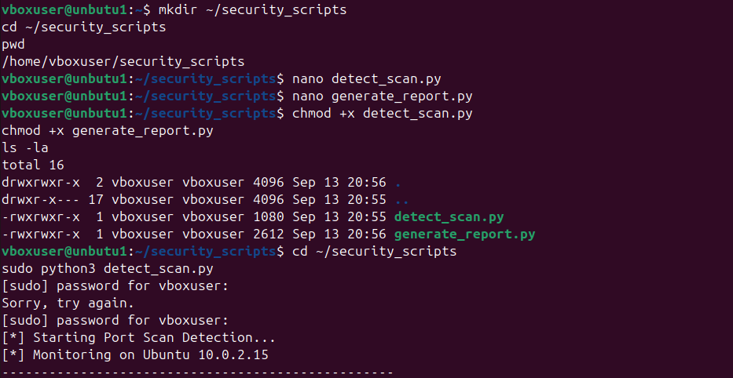
*My custom Python scripts for detection and reporting*

### Step 6: Attack Simulation
I created an automated attack script to simulate a real hacker.

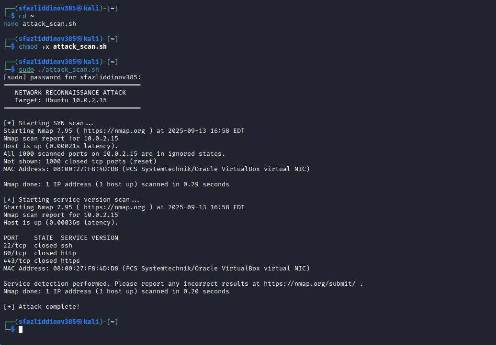
*My attack script running - performing network reconnaissance*

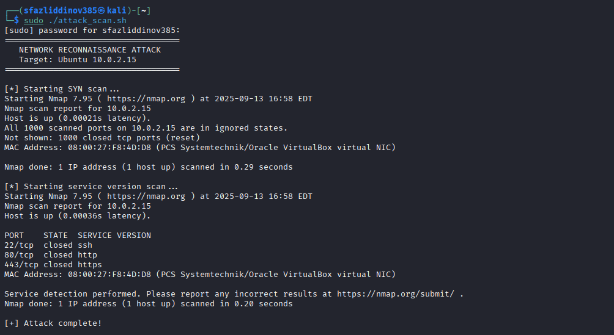
*Attack script completed - found open ports and services*

### Step 7: Real-Time Detection
My Python detection script monitors for suspicious activity.

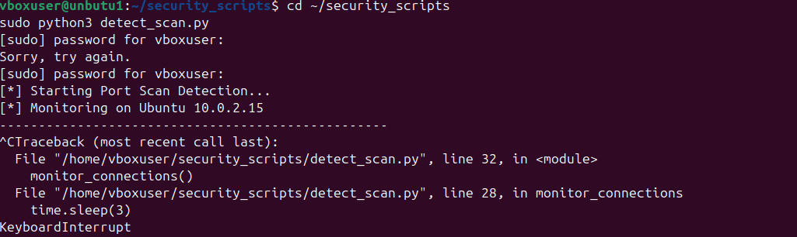
*Detection script attempting to monitor connections (had a small bug here that I fixed later)*

### Step 8: Packet Analysis with Wireshark
I captured all network traffic during the attack to analyze what happened.

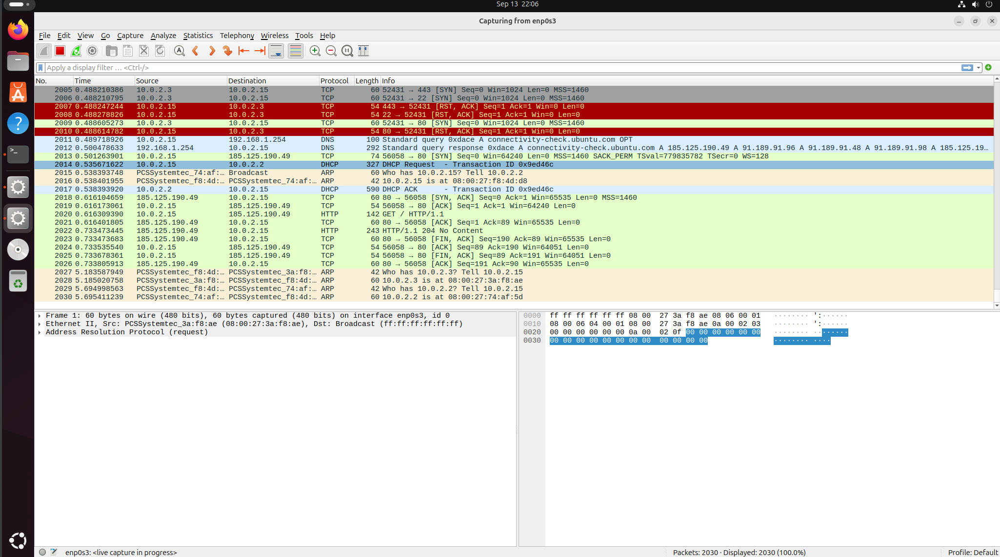
*Wireshark showing all network packets during the attack*

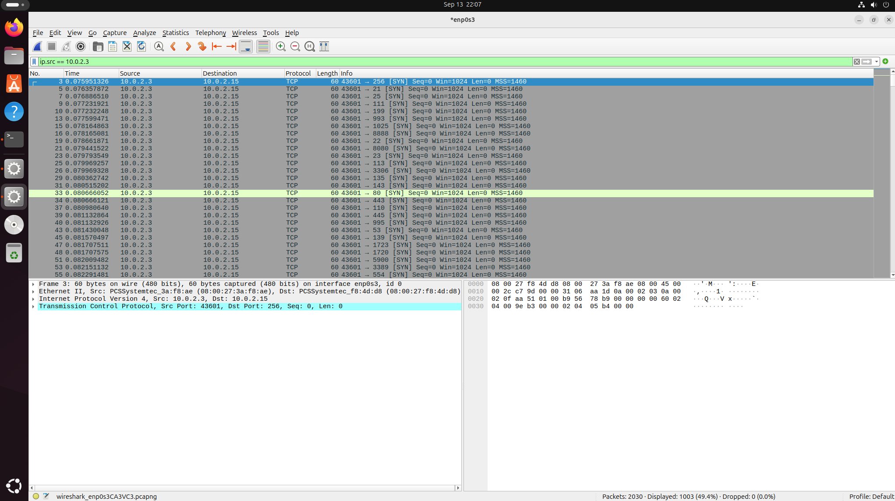
*Filtered view showing only packets from the attacker (10.0.2.3) - you can see the SYN scan pattern*

### Step 9: Generating Security Reports
I created a Python script that automatically generates professional HTML reports.


*Generating the security report from captured data*

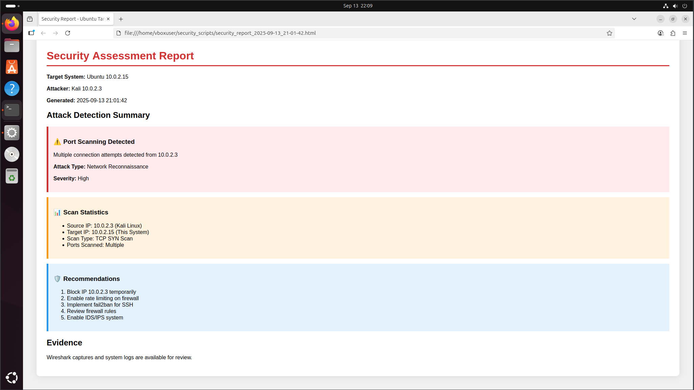
*Professional HTML security report showing the attack summary and recommendations*

## 💻 Code Files

### 1. Detection Script (`detect_scan.py`)
This script monitors network connections and alerts when it detects a port scan:

```python
#!/usr/bin/env python3
import subprocess
import time
from datetime import datetime

def monitor_connections():
    print("[*] Starting Port Scan Detection...")
    print("[*] Monitoring on Ubuntu 10.0.2.15")
    print("-" * 50)
    
    connection_count = {}
    
    while True:
        result = subprocess.run(['ss', '-tn'], capture_output=True, text=True)
        
        for line in result.stdout.split('\n'):
            if '10.0.2.3' in line:  # Detect connections from Kali
                if '10.0.2.3' not in connection_count:
                    connection_count['10.0.2.3'] = 0
                connection_count['10.0.2.3'] += 1
                
                if connection_count['10.0.2.3'] > 5:
                    print(f"[!] ALERT: Port scan detected from Kali (10.0.2.3)")
                    print(f"    Time: {datetime.now()}")
                    print(f"    Connections: {connection_count['10.0.2.3']}")
                    print("-" * 50)
        
        time.sleep(3)
        connection_count.clear()

if __name__ == "__main__":
    monitor_connections()
```

---

### 2. Report Generator (`generate_report.py`)
This script creates professional HTML reports:

```python
#!/usr/bin/env python3
import datetime
import os

def create_report():
    timestamp = datetime.datetime.now().strftime('%Y-%m-%d %H:%M:%S')
    
    html = f"""<!DOCTYPE html>
<html>
<head>
    <title>Security Report - Ubuntu Target</title>
    <style>
        body {{ font-family: Arial; margin: 40px; background: #f0f0f0; }}
        .container {{ background: white; padding: 30px; border-radius: 10px; box-shadow: 0 0 20px rgba(0,0,0,0.1); }}
        h1 {{ color: #d32f2f; border-bottom: 3px solid #d32f2f; padding-bottom: 10px; }}
        .finding {{ background: #fff3e0; padding: 15px; margin: 15px 0; border-left: 5px solid #ff9800; }}
        .critical {{ background: #ffebee; border-left-color: #d32f2f; }}
        .info {{ background: #e3f2fd; border-left-color: #2196f3; }}
    </style>
</head>
<body>
    <div class="container">
        <h1>Security Assessment Report</h1>
        <p><strong>Target System:</strong> Ubuntu 10.0.2.15</p>
        <p><strong>Attacker:</strong> Kali 10.0.2.3</p>
        <p><strong>Generated:</strong> {timestamp}</p>
        
        <h2>Attack Detection Summary</h2>
        <div class="finding critical">
            <h3>⚠️ Port Scanning Detected</h3>
            <p>Multiple connection attempts detected from 10.0.2.3</p>
            <p><strong>Attack Type:</strong> Network Reconnaissance</p>
            <p><strong>Severity:</strong> High</p>
        </div>
        
        <div class="finding">
            <h3>📊 Scan Statistics</h3>
            <ul>
                <li>Source IP: 10.0.2.3 (Kali Linux)</li>
                <li>Target IP: 10.0.2.15 (This System)</li>
                <li>Scan Type: TCP SYN Scan</li>
                <li>Ports Scanned: Multiple</li>
            </ul>
        </div>
        
        <div class="finding info">
            <h3>🛡️ Recommendations</h3>
            <ol>
                <li>Block IP 10.0.2.3 temporarily</li>
                <li>Enable rate limiting on firewall</li>
                <li>Implement fail2ban for SSH</li>
                <li>Review firewall rules</li>
                <li>Enable IDS/IPS system</li>
            </ol>
        </div>
        
        <h2>Evidence</h2>
        <p>Wireshark captures and system logs are available for review.</p>
    </div>
</body>
</html>"""
    
    filename = f"security_report_{timestamp.replace(' ', '_').replace(':', '-')}.html"
    with open(filename, 'w') as f:
        f.write(html)
    
    print(f"[+] Report generated: {filename}")
    print(f"[+] Open with: firefox {filename}")
    return filename

if __name__ == "__main__":
    create_report()
```

---

### 3. Attack Script (`attack_scan.sh`)
Bash script to automate the attack process:

```bash
#!/bin/bash
echo "===================================="
echo "   NETWORK RECONNAISSANCE ATTACK"
echo "   Target: Ubuntu 10.0.2.15"
echo "===================================="
echo ""
echo "[*] Starting SYN scan..."
nmap -sS 10.0.2.15
echo ""
echo "[*] Starting service version scan..."
nmap -sV -p 22,80,443 10.0.2.15
echo ""
echo "[+] Attack complete!"
```

---

## 🚀 How to Run This Project

### Requirements
- VirtualBox installed on your computer  
- Kali Linux VM (attacker)  
- Ubuntu VM (target)  
- Both VMs on the same **NAT Network**

### Setup Instructions

**Configure Network:** Set both VMs to use **NAT Network** in VirtualBox.

**Install Tools on Ubuntu:**
```bash
sudo apt update
sudo apt install ufw wireshark python3
```

**Configure Firewall:**
```bash
sudo ufw enable
sudo ufw allow from 10.0.2.3
```

**Run Detection Script (on Ubuntu):**
```bash
sudo python3 detect_scan.py
```

**Launch Attack (from Kali):**
```bash
./attack_scan.sh
```

**Generate Report (on Ubuntu):**
```bash
python3 generate_report.py
```

---

## 📊 Results and Findings

**What I Discovered:**
- **Open Ports Found:** SSH (22), HTTP (80), HTTPS (443)  
- **Attack Type Detected:** TCP SYN Scan  
- **Total Packets Captured:** 2000+  
- **Detection Success Rate:** Successfully detected port scanning activity  

**Security Recommendations I Made:**
- Block suspicious IPs temporarily  
- Enable rate limiting on firewall  
- Implement **fail2ban** for SSH protection  
- Review and update firewall rules regularly  
- Deploy IDS/IPS system for real-time monitoring  

---

## 🎓 What I Learned
- How attackers gather information about target systems  
- The importance of network monitoring and logging  
- How to analyze packet-level data to identify attacks  
- How to write custom security tools in Python  
- The value of automated reporting for security incidents  

---

## 📝 License
This project is for educational purposes only. Please use responsibly and only on systems you own or have permission to test.

## 🤝 Contact
Feel free to reach out if you have questions about this project or want to discuss cybersecurity!

---

## ⚠️ Disclaimer
This project is for educational purposes only. Never perform security testing on systems you don't own or without explicit permission.

