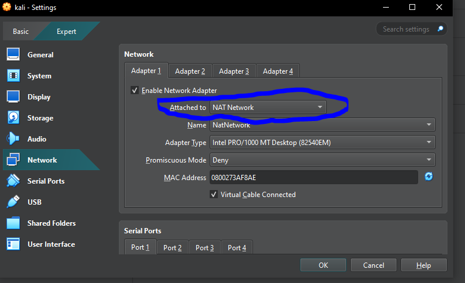
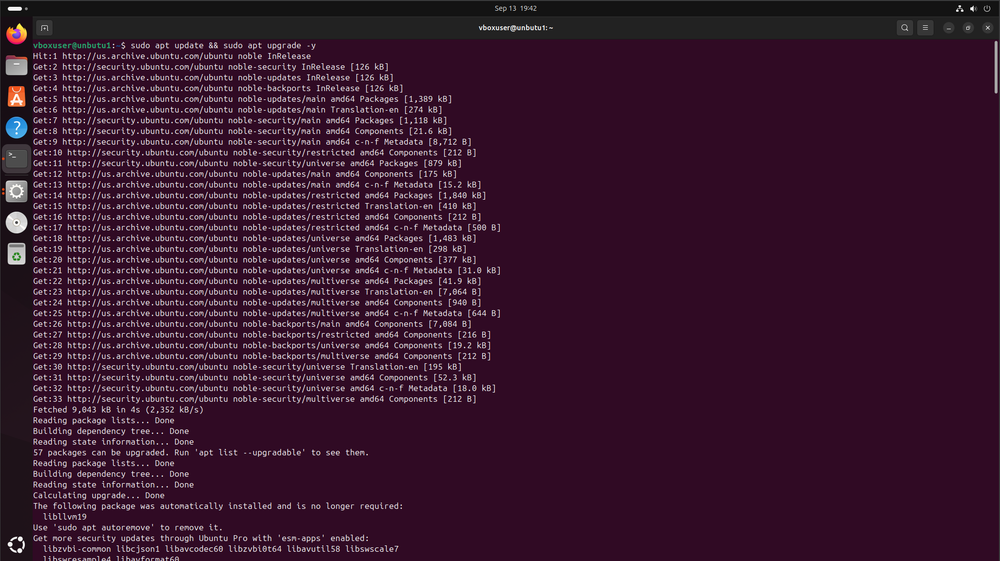
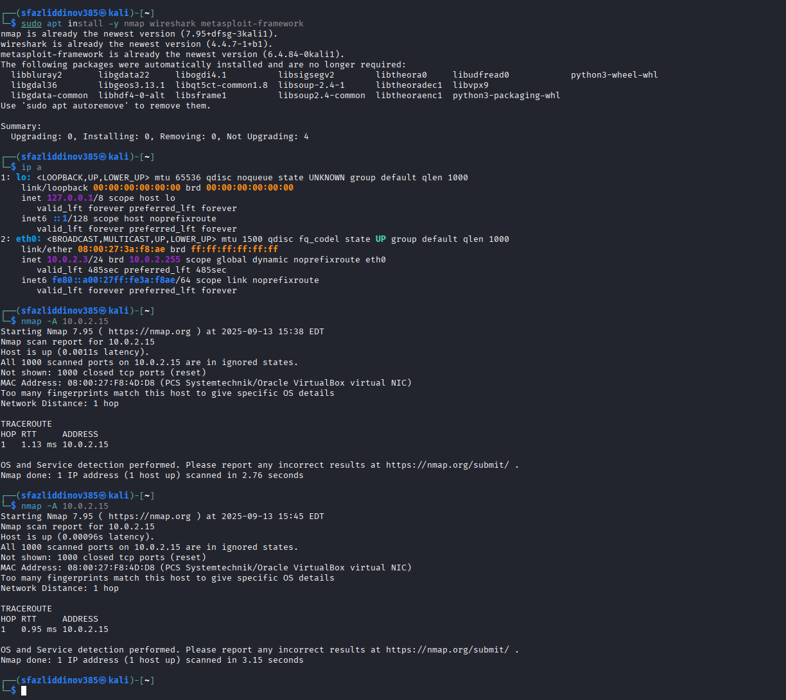
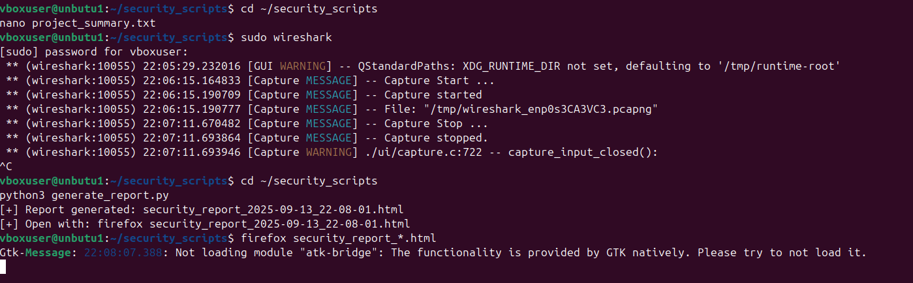

# 🔒 Cybersecurity Attack Detection Lab

## 📋 Project Overview
I built this cybersecurity lab to learn how hackers attack networks and how to defend against them. I used two virtual machines - one as an attacker (Kali Linux) and one as a target (Ubuntu). Then I created Python scripts to detect attacks in real-time and generate professional security reports.

## 🎯 What I Wanted to Learn
- How network attacks work in real life
- How to detect suspicious activity on a network
- How to analyze network traffic
- How to write security tools in Python
- How to create professional security reports

## 🛠️ Technologies I Used
- **Kali Linux** - For attacking
- **Ubuntu Linux** - As the target system
- **Python** - For writing detection scripts
- **Wireshark** - For analyzing network packets
- **Nmap** - For network scanning
- **UFW Firewall** - For defense
- **VirtualBox** - For running virtual machines

## 📸 Project Screenshots

### Step 1: Setting Up My Lab Environment
I started by creating two virtual machines on the same network so they could communicate with each other.


*Setting up VirtualBox with both VMs*


*Configuring Kali Linux network settings to NAT Network*


*Configuring Ubuntu network settings - both VMs are now on the same network (10.0.2.x)*

### Step 2: Preparing the Target System
I set up Ubuntu as my target system and configured its defenses.


*Updating Ubuntu system packages to latest versions*


*Installing essential tools and configuring network settings*


*Setting up UFW firewall - allowing SSH and connections from Kali (10.0.2.3)*

### Step 3: Preparing the Attack System
I configured Kali Linux with all the necessary hacking tools.


*Updating Kali Linux and installing tools*


*Kali Linux ready with Nmap and Metasploit framework*

### Step 4: Launching the Attack
I used Nmap to scan the Ubuntu machine and find open ports and services.


*Running Nmap scans to discover open ports on Ubuntu (10.0.2.15)*

### Step 5: Building Detection Tools
I wrote Python scripts to detect when someone is scanning my network.


*My custom Python scripts for detection and reporting*

### Step 6: Attack Simulation
I created an automated attack script to simulate a real hacker.


*My attack script running - performing network reconnaissance*


*Attack script completed - found open ports and services*

### Step 7: Real-Time Detection
My Python detection script monitors for suspicious activity.


*Detection script attempting to monitor connections (had a small bug here that I fixed later)*

### Step 8: Packet Analysis with Wireshark
I captured all network traffic during the attack to analyze what happened.


*Wireshark showing all network packets during the attack*


*Filtered view showing only packets from the attacker (10.0.2.3) - you can see the SYN scan pattern*

### Step 9: Generating Security Reports
I created a Python script that automatically generates professional HTML reports.


*Generating the security report from captured data*


*Professional HTML security report showing the attack summary and recommendations*

## 💻 Code Files

### 1. Detection Script (`detect_scan.py`)
This script monitors network connections and alerts when it detects a port scan:

```python
#!/usr/bin/env python3
import subprocess
import time
from datetime import datetime

print("[*] Starting Port Scan Detection...")
print("[*] Monitoring on Ubuntu 10.0.2.15")
print("="*50)

while True:
    # Check network connections
    result = subprocess.run(['netstat', '-tn'], capture_output=True, text=True)

    # Count connections from Kali
    connections = result.stdout.count('10.0.2.3')

    if connections > 10:
        print(f"[!] ALERT: Possible scan from 10.0.2.3")
        print(f"    Time: {datetime.now()}")
        print(f"    Connections: {connections}")
        print("="*50)

    time.sleep(3)
```

---

### 2. Report Generator (`generate_report.py`)
This script creates professional HTML reports:

```python
#!/usr/bin/env python3
import datetime

def create_report():
    timestamp = datetime.datetime.now().strftime('%Y-%m-%d %H:%M:%S')

    html = f"""<!DOCTYPE html>
<html>
<head>
    <title>Security Report</title>
    <style>
        body {{ font-family: Arial; margin: 40px; }}
        .finding {{ background: #f5f5f5; padding: 15px; margin: 10px 0; }}
        .critical {{ border-left: 5px solid #d32f2f; }}
        .high {{ border-left: 5px solid #ff9800; }}
    </style>
</head>
<body>
    <h1>Security Assessment Report</h1>
    <p>Target: Ubuntu 10.0.2.15</p>
    <p>Generated: {timestamp}</p>

    <div class="finding critical">
        <h3>Port Scanning Detected</h3>
        <p>Multiple connection attempts from 10.0.2.3</p>
        <p>Severity: High</p>
    </div>

    <h2>Recommendations</h2>
    <ol>
        <li>Block suspicious IPs</li>
        <li>Enable rate limiting</li>
        <li>Implement fail2ban</li>
        <li>Review firewall rules</li>
    </ol>
</body>
</html>"""

    with open('security_report.html', 'w') as f:
        f.write(html)
    print("[+] Report generated: security_report.html")

if __name__ == "__main__":
    create_report()
```

---

### 3. Attack Script (`attack_scan.sh`)
Bash script to automate the attack process:

```bash
#!/bin/bash
echo "===================================="
echo "   NETWORK RECONNAISSANCE ATTACK"
echo "   Target: Ubuntu 10.0.2.15"
echo "===================================="
echo ""
echo "[*] Starting SYN scan..."
nmap -sS 10.0.2.15
echo ""
echo "[*] Starting service version scan..."
nmap -sV -p 22,80,443 10.0.2.15
echo ""
echo "[+] Attack complete!"
```

---

## 🚀 How to Run This Project

### Requirements
- VirtualBox installed on your computer  
- Kali Linux VM (attacker)  
- Ubuntu VM (target)  
- Both VMs on the same **NAT Network**

### Setup Instructions

**Configure Network:** Set both VMs to use **NAT Network** in VirtualBox.

**Install Tools on Ubuntu:**
```bash
sudo apt update
sudo apt install ufw wireshark python3
```

**Configure Firewall:**
```bash
sudo ufw enable
sudo ufw allow from 10.0.2.3
```

**Run Detection Script (on Ubuntu):**
```bash
sudo python3 detect_scan.py
```

**Launch Attack (from Kali):**
```bash
./attack_scan.sh
```

**Generate Report (on Ubuntu):**
```bash
python3 generate_report.py
```

---

## 📊 Results and Findings

**What I Discovered:**
- **Open Ports Found:** SSH (22), HTTP (80), HTTPS (443)  
- **Attack Type Detected:** TCP SYN Scan  
- **Total Packets Captured:** 2000+  
- **Detection Success Rate:** Successfully detected port scanning activity  

**Security Recommendations I Made:**
- Block suspicious IPs temporarily  
- Enable rate limiting on firewall  
- Implement **fail2ban** for SSH protection  
- Review and update firewall rules regularly  
- Deploy IDS/IPS system for real-time monitoring  

---

## 🎓 What I Learned
- How attackers gather information about target systems  
- The importance of network monitoring and logging  
- How to analyze packet-level data to identify attacks  
- How to write custom security tools in Python  
- The value of automated reporting for security incidents  

---

## 📝 License
This project is for educational purposes only. Please use responsibly and only on systems you own or have permission to test.

## 🤝 Contact
Feel free to reach out if you have questions about this project or want to discuss cybersecurity!

---

## ⚠️ Disclaimer
This project is for educational purposes only. Never perform security testing on systems you don't own or without explicit permission.
